# Pseudocode + Flowcharts (Mermaid)

Pseudocode with layman comments + Mermaid flowchart for each algorithm. Mermaid renders natively on GitHub and can be imported to draw.io via File → Import → Mermaid. A sample `.drawio` XML is in `sample_linear_regression.drawio` for format reference.

---

## How to render
- On GitHub: `.md` flowcharts render automatically.
- Locally: VSCode + Markdown Preview Mermaid Support.
- draw.io: File → Import from → Mermaid (paste code).

---

# Classical ML

## Linear Regression
```
# Goal: find w, b so y ≈ w·x + b
initialize w, b (zero or random)
for epoch in range(E):
    for batch (X, y) from data:
        y_hat = X · w + b          # predict
        error = y_hat - y          # how wrong
        grad_w = X^T · error / n   # tilt of loss wrt w
        grad_b = mean(error)       # tilt of loss wrt b
        w -= lr * grad_w           # step downhill
        b -= lr * grad_b
return w, b
```
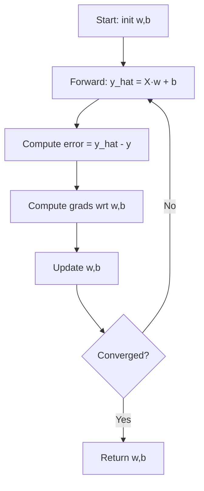

## Logistic Regression
```
initialize w, b = 0
for epoch:
    z = X·w + b
    p = sigmoid(z)        # prob of class 1
    grad_w = X^T · (p - y) / n
    grad_b = mean(p - y)
    w -= lr * grad_w; b -= lr * grad_b
```
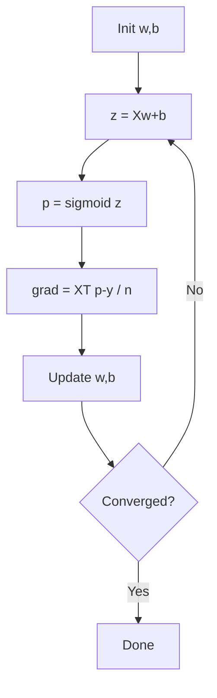

## Decision Tree
```
build_tree(data):
    if stop_condition (pure node or max depth):
        return leaf (majority class / mean)
    best_feature, best_threshold = argmax over (feature, t) of impurity_drop
        where impurity = gini or entropy
    left, right = split data on (best_feature, best_threshold)
    node = Node(best_feature, best_threshold)
    node.left = build_tree(left)
    node.right = build_tree(right)
    return node
```
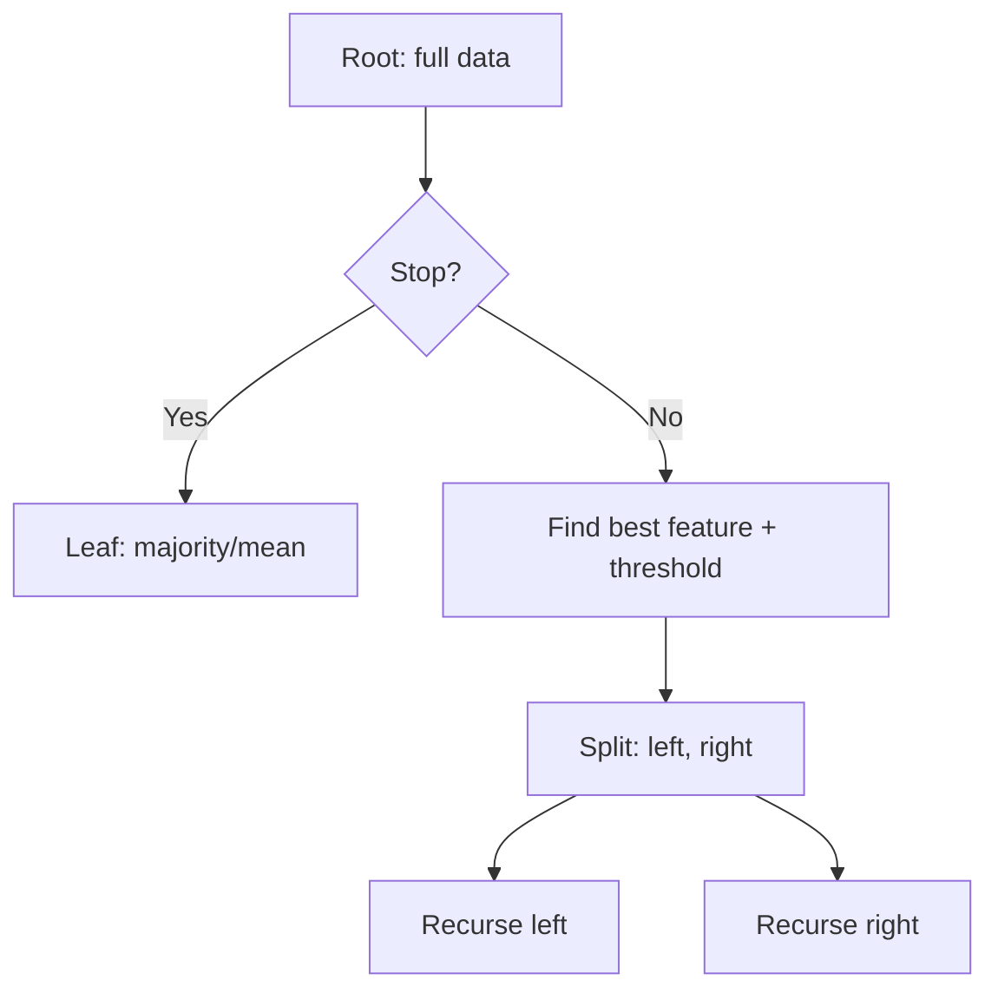

## Random Forest
```
for t in 1..T:
    sample_t = bootstrap(data)         # sample with replacement
    tree_t = build_tree(sample_t,
                        feature_subset=random_subset())
    forest.append(tree_t)
predict(x) = mode / mean over trees
```
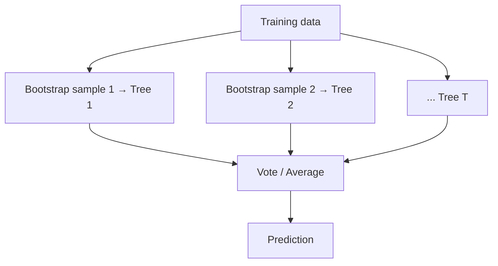

## Gradient Boosting
```
f0 = mean(y)
for m in 1..M:
    residuals = y - f_{m-1}(X)            # what's left to explain
    tree_m = fit small tree on (X, residuals)
    f_m = f_{m-1} + lr * tree_m
```
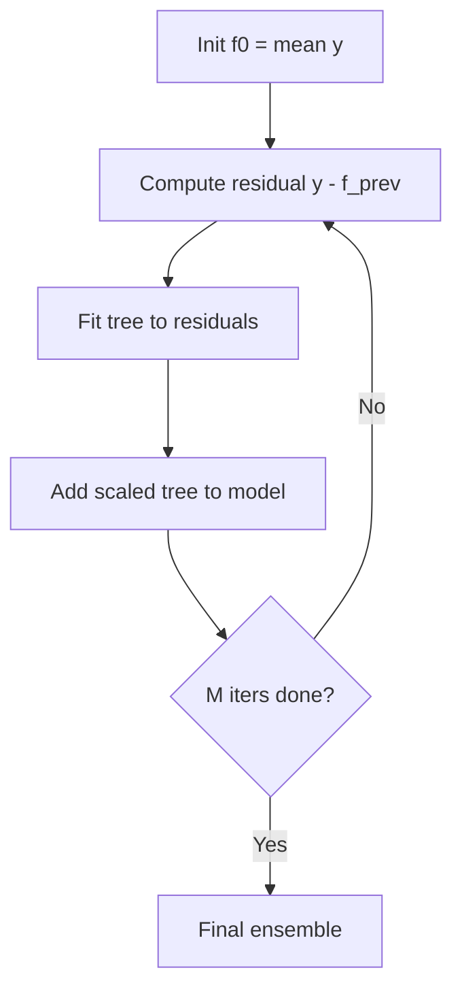

## SVM (soft-margin, SMO outline)
```
solve: min_w (1/2 |w|^2 + C Σ ξ_i)
       s.t. y_i (w·x_i + b) >= 1 - ξ_i,  ξ_i >= 0
SMO: pick pair (α_i, α_j), analytically optimize subject to constraints, repeat
```
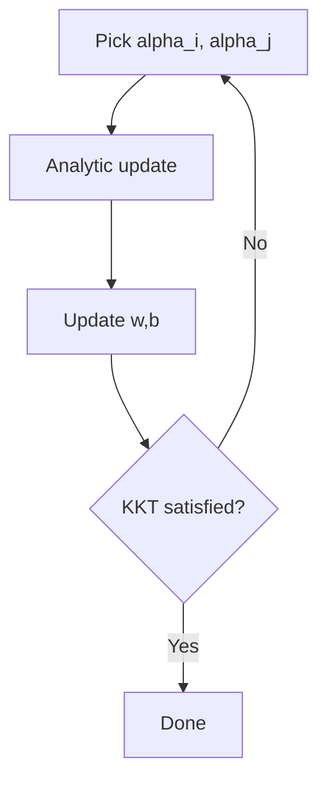

## KNN
```
predict(x):
    distances = [dist(x, xi) for xi in train]
    neighbors = argsort(distances)[:k]
    return majority_vote(y[neighbors])     # classify
             or mean(y[neighbors])         # regression
```
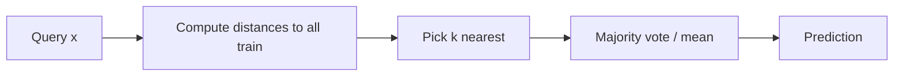

## Naive Bayes
```
fit:
    for class c: P(c) = count(y==c)/n
    for feature j, class c:
        fit Gaussian μ_{c,j}, σ_{c,j}  # (or multinomial counts)
predict(x):
    for c: score_c = log P(c) + Σ_j log P(x_j | c)
    return argmax_c score_c
```

## KMeans
```
initialize k centroids (k-means++)
repeat:
    assign each point to nearest centroid
    recompute centroid = mean of its points
until assignments don't change
```
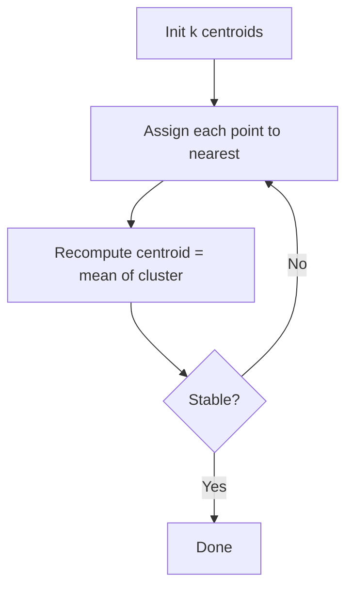

## DBSCAN
```
for each unvisited point p:
    mark visited
    neighbors = region_query(p, eps)
    if |neighbors| < minPts: mark p as NOISE
    else: expand_cluster(p, neighbors, new cluster id)

expand_cluster(p, N, C):
    assign p to C
    while N non-empty:
        q = N.pop()
        if q unvisited:
            mark visited
            N_q = region_query(q, eps)
            if |N_q| >= minPts: N.extend(N_q)
        if q unassigned: assign q to C
```

## PCA
```
X_c = X - mean(X)
C = X_c^T X_c / (n-1)          # covariance
eigenvalues, eigenvectors = eig(C)
sort by eigenvalues desc
W = top-k eigenvectors
Z = X_c · W                    # projection
```

## GMM (EM)
```
init π_k, μ_k, Σ_k
repeat:
    # E-step
    γ_{ik} = π_k N(x_i | μ_k, Σ_k) / Σ_j π_j N(x_i | μ_j, Σ_j)
    # M-step
    N_k = Σ_i γ_{ik}
    π_k = N_k / n
    μ_k = Σ_i γ_{ik} x_i / N_k
    Σ_k = Σ_i γ_{ik} (x_i - μ_k)(x_i - μ_k)^T / N_k
until log-likelihood converges
```

## AdaBoost
```
w_i = 1/n for all i
for t in 1..T:
    fit weak learner h_t on weighted data
    err_t = Σ w_i [h_t(x_i) != y_i] / Σ w_i
    α_t = 0.5 * ln((1 - err_t) / err_t)
    w_i *= exp(α_t * [h_t(x_i) != y_i])
    w_i /= Σ w_i
final: sign(Σ α_t h_t(x))
```

---

# Deep Learning

## MLP forward + SGD
```
for (x, y) in batches:
    a0 = x
    for layer l = 1..L:
        z_l = W_l a_{l-1} + b_l
        a_l = activation(z_l)
    loss = CE(a_L, y)
    # backward
    δ_L = a_L - y                         # for softmax+CE
    for l = L..1:
        grad_W_l = δ_l a_{l-1}^T
        grad_b_l = δ_l
        δ_{l-1} = (W_l^T δ_l) ⊙ activation'(z_{l-1})
    W, b -= lr * grads
```
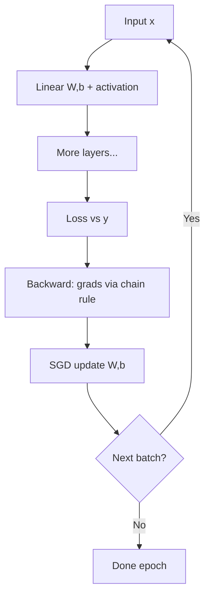

## CNN training
```
for (X, y):
    feature maps = conv layers + pooling   # with ReLU
    flat = flatten(final maps)
    logits = FC(flat)
    loss = CE(logits, y)
    backprop through FC, conv (∂L/∂K = X ⋆ ∂L/∂F)
    update weights
```

## RNN / LSTM training (BPTT)
```
for each sequence (x_1..x_T, y):
    h_0 = 0
    for t = 1..T:
        h_t = cell(h_{t-1}, x_t)           # vanilla / LSTM / GRU
    loss = task_loss(h_T or {h_t}, y)
    # BPTT: backprop through time, sum gradients of shared W
    update weights
```

## Transformer block (forward)
```
# input X: (B, T, d)
Q = X W_Q; K = X W_K; V = X W_V
A = softmax(Q K^T / sqrt(d_k))  # add causal mask if decoder
attn_out = A V
X = LN(X + drop(attn_out))      # residual + LayerNorm
ff  = W_2 gelu(W_1 X)
X = LN(X + drop(ff))
```

## Autoencoder
```
z = encoder(x)
x_hat = decoder(z)
loss = MSE(x, x_hat)
backprop, update encoder+decoder
```

## VAE
```
mu, logvar = encoder(x)
eps ~ N(0, I)
z = mu + exp(0.5 logvar) ⊙ eps
x_hat = decoder(z)
loss = BCE(x_hat, x) + KL(mu, logvar)  # KL closed form
backprop
```

## GAN
```
for step:
    # train D
    real = x; z ~ N(0, I); fake = G(z)
    loss_D = -log D(real) - log(1 - D(fake))
    update D
    # train G
    z ~ N(0, I); fake = G(z)
    loss_G = -log D(fake)        # non-saturating
    update G
```

## Diffusion (DDPM training step)
```
t ~ Uniform(1..T)
noise ~ N(0, I)
x_t = sqrt(alpha_bar_t) x_0 + sqrt(1 - alpha_bar_t) noise
pred = eps_theta(x_t, t)
loss = MSE(pred, noise)
update eps_theta
```

## GCN forward
```
A_hat = D^{-1/2} (A+I) D^{-1/2}
H^(l+1) = relu(A_hat H^(l) W^(l))
```

---

# RL

## Q-Learning
```
init Q[s,a] = 0
for episode:
    s = reset
    while not done:
        a = ε-greedy wrt Q(s, ·)
        s', r, done = env.step(a)
        Q[s,a] += α (r + γ max_a' Q[s',a'] - Q[s,a])
        s = s'
```
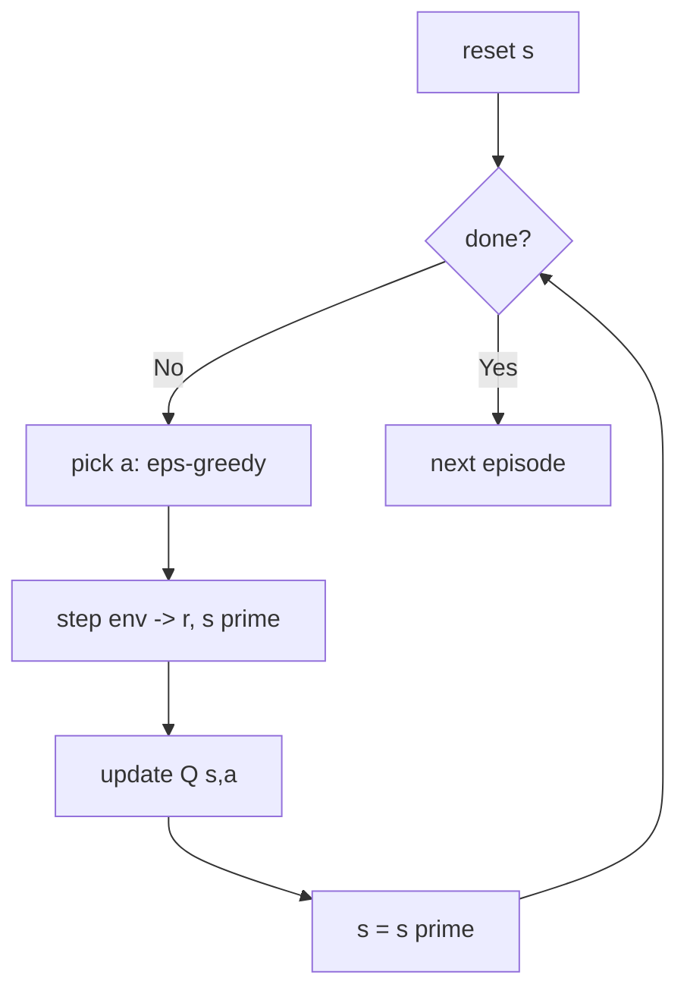

## SARSA
```
a = ε-greedy(s)
while not done:
    s', r, done = env.step(a)
    a' = ε-greedy(s')
    Q[s,a] += α (r + γ Q[s',a'] - Q[s,a])
    s, a = s', a'
```

## DQN
```
init Q net, target Q_t, replay buffer
while steps:
    a = ε-greedy using Q(s)
    s', r, done = env.step(a)
    buffer.add(s,a,r,s',done)
    if |buffer| >= batch:
        B = sample(buffer)
        target = r + γ max_{a'} Q_t(s',a') (1-done)
        loss = MSE(Q(s,a), target)
        update Q
    every C steps: Q_t <- Q
```

## REINFORCE
```
for episode:
    rollout trajectory tau with π_θ
    compute returns G_t
    loss = -Σ_t log π_θ(a_t|s_t) * G_t
    step optimizer
```

## PPO
```
collect N steps with π_old
compute advantages A (GAE)
for K epochs over minibatches:
    r = π_new(a|s) / π_old(a|s)
    L_CLIP = min(r A, clip(r, 1-eps, 1+eps) A)
    loss = -mean(L_CLIP) + c_v MSE(V, R) - c_e H(π)
    update
π_old <- π_new
```

## SAC (key step)
```
for step:
    a ~ π_θ(s)  (reparameterized)
    store (s,a,r,s',d)
    batch:
        with no grad:
            a', logp' = π(s')
            q_t = min(Q1_t(s',a'), Q2_t(s',a')) - α logp'
            y = r + γ (1-d) q_t
        L_Q = MSE(Q1(s,a), y) + MSE(Q2(s,a), y)
        a_new, logp = π(s)
        L_π = E[α logp - min(Q1(s,a_new), Q2(s,a_new))]
        L_α = -α (logp + H_target).detach()
    soft update Q_t <- τ Q + (1-τ) Q_t
```

## MCTS (4-step loop)
```
for iter in 1..N:
    # 1. Selection: traverse from root using UCB until unexpanded
    # 2. Expansion: add one child
    # 3. Simulation: random rollout to terminal
    # 4. Backprop: propagate reward up
choose child of root with highest visit count
```
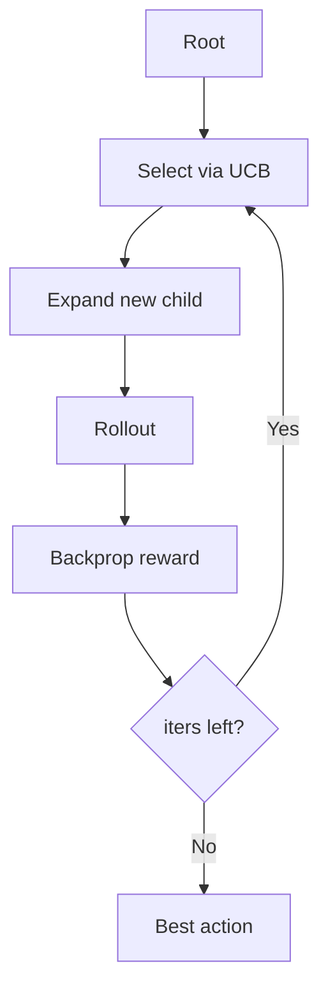

## MADDPG
```
per agent i: actor π_i (local obs), critic Q_i (all obs + all actions)
for step:
    each agent i picks a_i = π_i(o_i) + noise
    step env: (o, a) → (o', r, d)
    store (o, a, r, o', d) in shared replay
    sample batch:
        target y_i = r_i + γ Q_i_target(o', a'_joint_from_target_policies)(1-d)
        L_Q_i = (Q_i(o, a) - y_i)^2
        L_π_i = -Q_i(o, (π_i(o_i), a_{-i}))
        update
    soft-update targets
```

---

# AI / Agentic

## RAG (standard)
```
query = user_message
embeddings = embed(query)
docs = vector_db.search(embeddings, k)
context = concat(docs)
answer = llm(system_prompt + context + query)
```


## ReAct Agent
```
thought_history = []
while not done:
    prompt = system + history + obs
    out = llm(prompt)
    if out.contains("Action"):
        result = tool.execute(out.action)
        history.append((out, result))
    elif out.contains("Final"):
        return out.final
```
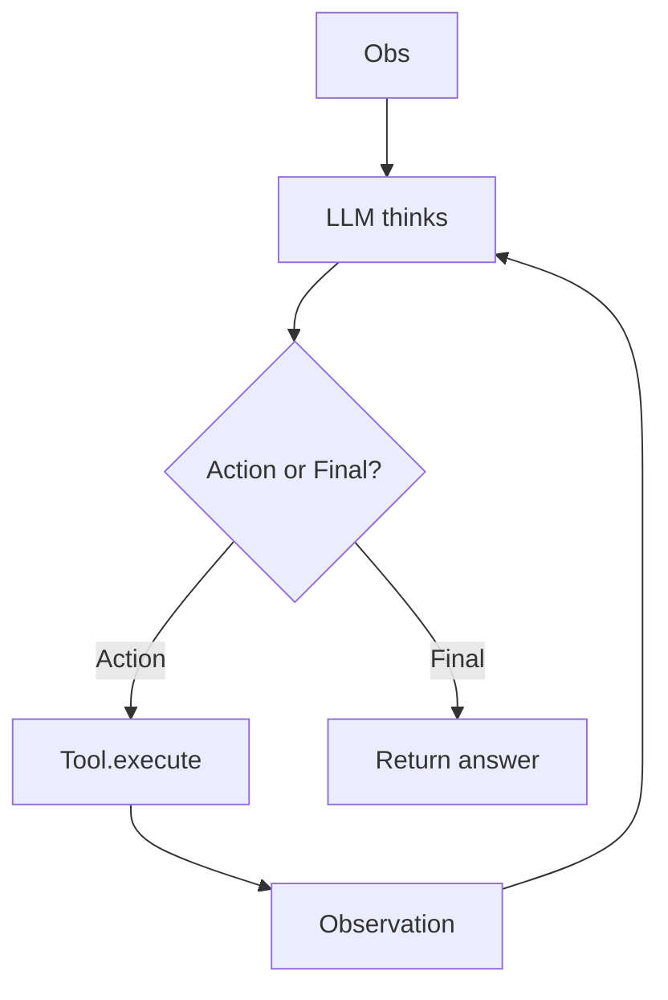

## PPO for RLHF
```
prompt dataset D
for epoch:
    for batch prompts p:
        response r ~ π_θ(·|p)
        reward = RM(p, r) - β KL(π_θ || π_ref)   # KL penalty to SFT
        PPO update using r as reward
```

## DPO
```
for (prompt, chosen, rejected) in pref_data:
    logits_c = log π_θ(chosen|prompt) - log π_ref(chosen|prompt)
    logits_r = log π_θ(rejected|prompt) - log π_ref(rejected|prompt)
    loss = -log σ(β (logits_c - logits_r))
    step optimizer
```

## GRPO (simplified)
```
for prompt p:
    sample G responses {r_1..r_G} ~ π_θ
    scores s_i = reward(p, r_i) (or rule-based for math/code)
    A_i = (s_i - mean(s)) / std(s)      # group-normalized advantage
    loss = -mean_i A_i log π_θ(r_i | p)  + KL penalty
    step
```

## MCTS + LLM (o1-style reasoning sketch)
```
for each problem:
    root = state(problem)
    for iters:
        node = select_by_puct(root)
        expand with LLM-generated next steps
        simulate / value = LLM eval
        backprop
    pick path with best aggregate
```

---

# When drawio XML needed
See `sample_linear_regression.drawio` for the exact format. Template for any flow:
1. Replace node `value="..."` with step text.
2. Add/remove `<mxCell edge="1" source="X" target="Y">` to connect steps.
3. Import into draw.io desktop/web, or open directly.

A one-time conversion: the Mermaid blocks above can be pasted into **draw.io → Extras → Edit Diagram → Mermaid** to get editable diagrams.
